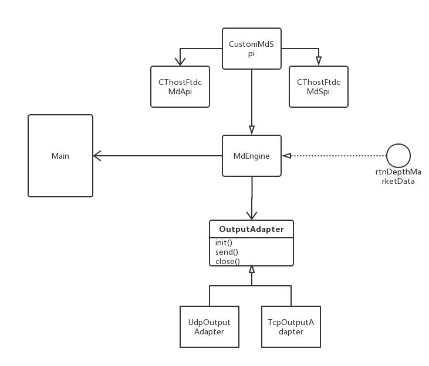
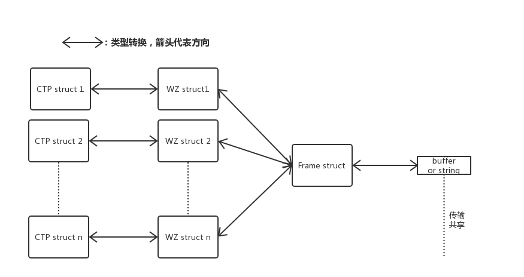

# MdServer

Author：李嘉恒，胡子昂

## 程序基本框架图

- MdEngine：

  Md运行基类，拥有接口rtnDepthMarketData。在实现类收到数据时，调用此接口，使用包含的OutputAdapter实例发送数据。

- CustomMdSpi：

  MdEngine的实现。该类继承CThostFtdcMdSpi，包含CThostFtdcMdApi，使用给定的CTP接口实现各种需求。

- CThostFtdcMdApi和CThostFtdcMdSpi：

  CTP提供类。

- OutputAdapter：

  Output适配器，拥有send虚函数用于发送数据，供子类实现。

- UdpOutputAdapter：

  Output的udp方式实现，可以通过udp广播的方式共享数据。

- TcpOutputAdapter：

  Output的tcp方式实现，可以通过tcp广播方式共享数据。

## 内置数据结构和转换：

- CTP structs：

  CTP提供的各种结构，转换成WZ对应的结构后，传入MdEngine。

- WZ structs：

  自定义的各种结构，适配不同Api使用的数据结构。

- Frame：

  一个通用结构，便于数据发送和接收，内部包含WZ的数据，WZ的类型标志，操作标志和传输标志。

- buffer or string：

  buffer流和string流，用于数据传输或者共享。

## .ini文件结构：

- 本例中结构如下：

~~~ini
[UsrInfo]
UserID=114022
Password=0828WoShiLjhh

[Addr]
Md=tcp://180.168.146.187:10031
out=12345

[CtaInfo]
Contracts=AP805 CF805 CF809
~~~

- UsrInfo：包含用户信息
  - UserID：用户ID
  - Password：用户密码
- Addr：包含前置地址信息
  - Md：CTP的Md类前置端口
  - out：tcp输出端口
- CtaInfo：包含合约ID信息
  - Contracts：合约ID字符串，用空格分开

## Demo运行展示：

未成功运行：

~~~shell
$ ../bin/mdserver
Usage : ./mdserver -f CONFIG_FILE
        CONFIG_FILE : initial file path (.ini)
~~~

成功运行：

~~~shell
$ ../bin/mdserver -f ../config.ini
初始化行情...
连接成功，正在登录...
发送登录请求成功！
登录成功
交易日:20180314
登录时间:
用户名:
经济商:
发送行情请求成功
行情订阅成功
合约代码：AP805
行情订阅成功
合约代码：CF805
行情订阅成功
合约代码：CF809
===== Get Depth Market Data =====
Trading Day: 20180314
Exchange ID:
Instrument ID: CF805
Last Price: 15040
Volume: 83242
Turnover: 1.25238e+09
error: 11
===== Get Depth Market Data =====
Trading Day: 20180314
Exchange ID:
Instrument ID: CF809
Last Price: 15525
Volume: 35050
Turnover: 5.44151e+08
error: 11

~~~

