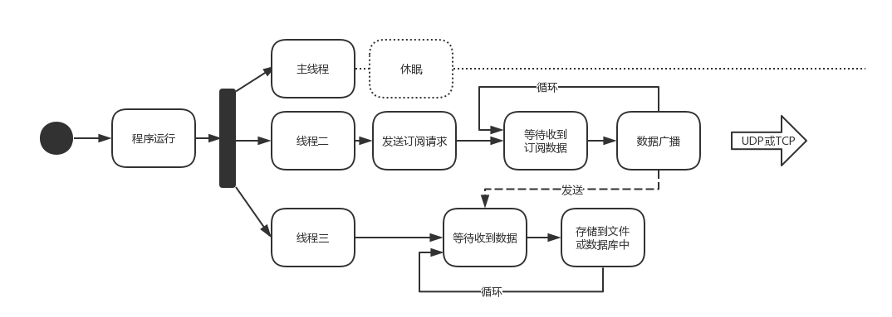

# WZMDServer

Author：胡子昂，李嘉恒

## 实现功能

- 订阅所有合约行情数据
- 实时行情数据传输
- 行情数据缓存队列
- 行情数据存储

## 详细设计

- 程序流程图

  


- 程序结构

  - 线程一：主线程

    主线程中调用以下两个线程，分别执行订阅行情和存储数据功能。

  - 线程二：订阅行情并发送

    通过外部提供的api接口，实现行情订阅，接受数据，最后通过通讯接口将接收的数据广播。与此同时，也将数据发送到线程三。

    ```c++
    MdEngine.h	(行情基类)
    	rtnDepthMarketData	深度行情数据回调函数
    	SetOutput	传输接口设置
    	ReqSubscribeMarketData	深度行情数据请求接口

    WZPiper.h  (进程间数据通讯基类)
        do_write  发送数据

    CustomMdSpi.h	(CTP柜台子类)
    ```

  - 线程三：数据存储/缓存

    接受数据后，将数据以二进制流的形式存储到文件中，为了不阻碍线程，设立缓冲区，如果缓冲区满的情况下接受到数据，将丢弃时间最早的数据。

    ```
    MessageQueue.h (线程间通讯类)
    	send  发送数据
    	receive  接收数据
    ```

    ​

- 配置文件

  ```ini
  [UsrInfo]
  UserID=112586
  Password=821361187

  [Addr]
  Md=tcp://180.168.146.187:10010

  [CtaInfo]
  ContractsFile=../test_code.csv

  [TCPNetInfo]
  ip=192.168.0.6
  port=25520

  [UDPNetInfo]
  ip=192.168.0.129
  port=25520

  [Logger]
  logtostderr=0
  alsologtostderr=1
  minloglevel=0
  stderrthreshold=2
  colorlogtostderr=0
  log_dir=../log

  ```

  - UsrInfo : 包含用户信息
    - UserID : 用户ID
    - Password : 用户密码
  - Addr : 前置地址信息
    - Md : CTP的Md类前置端口
  - CtaInfo : 合约ID信息
    - ContractsFile : 合约ID字符串，用空格分开
  - TCPNetInfo : TCP连接信息
    - ip : 目的ip
    - port : 目的端口
  - UDPNetInfo : UDP连接信息
    - ip : 目的ip
    - port : 目的端口
  - Logger : 日志配置信息
    - logtostderr : 0-输出到文件，1输出到stderr
    - alsologtostderr : 1-同时将日志输出到文件和stderr
    - minloglevel : 限制输出到 stderr 的部分信息，包括此错误级别和更高错误级别的日志信息
    - stderrthreshold : 除了将日志输出到文件之外，还将此错误级别和更高错误级别的日志同时输出到 stderr
    - colorlogtostderr : 将输出到 stderr 上的错误日志显示相应的颜色
    - log_dir  : 日志文件地址


- Demo运行展示

  - 未成功运行

    ```shell
    $ ../bin/mdserver
    Usage : ./mdserver -f CONFIG_FILE
            CONFIG_FILE : initial file path (.ini)
    ```

  - 成功运行

    ```shell
    $ ../bin/mdserver -f ../config.ini
    I0323 13:33:03.351981  1780 Logger.cpp:38] 初始化行情...
    I0323 13:33:03.384227  1787 CustomMdSpi.cpp:78] 连接成功，正在登录...
    I0323 13:33:03.384292  1787 CustomMdSpi.cpp:69] 发送登录请求成功！
    I0323 13:33:03.420795  1787 CustomMdSpi.cpp:100] 登录成功
    I0323 13:33:03.420825  1787 CustomMdSpi.cpp:101] 交易日:20180323
    I0323 13:33:03.420836  1787 CustomMdSpi.cpp:102] 登录时间:
    I0323 13:33:03.420846  1787 CustomMdSpi.cpp:103] 用户名:
    I0323 13:33:03.420855  1787 CustomMdSpi.cpp:104] 经济商:
    I0323 13:33:04.352424  1780 CustomMdSpi.cpp:54] 发送行情请求成功
    I0323 13:33:04.384171  1787 CustomMdSpi.cpp:133] 行情订阅成功
    I0323 13:33:04.384194  1787 CustomMdSpi.cpp:134] 合约代码：IF1806
    ```

  - 存储数据文件

    ```
    3230 3138 3033 3233 007a 0fc8 7749 4631
    3830 3600 0000 0000 0000 0000 0000 0000
    0000 0000 0000 0000 38a0 b5c7 777f 0000
    6666 6666 6638 ad40 3333 3333 33eb ae40
    0000 0000 00d6 ae40 0000 0000 00ad c440
    ...
    ```

    ​

  ​
